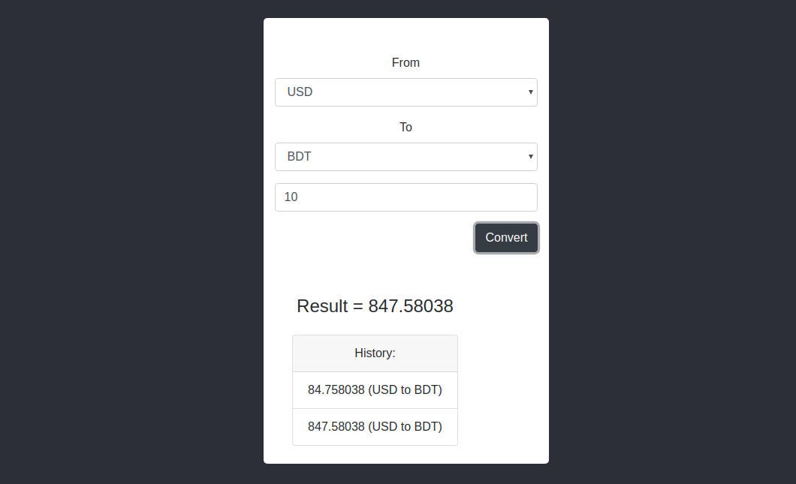

#### Demo: https://condescending-minsky-29c74b.netlify.com/

---

#### **What have I done!!**
- just made this converter using `React`. Have a view.
- Used api from `https://www.currencyconverterapi.com`.
- Select the currencies that you want then click _Convert_
button. Result will shown billow.

###### Limitations
- Tried to use `Redux` to manage state. But got a 
problem with that. So, you will see some related codes
there. Dont worry project is OK. Just run & you wiil
like it :D.

---
##### Instructions
- clone this repo. run `yarn install` to install the 
dependencies, then type `yarn start` to run.
- You have to connect to the internet to test this project.
